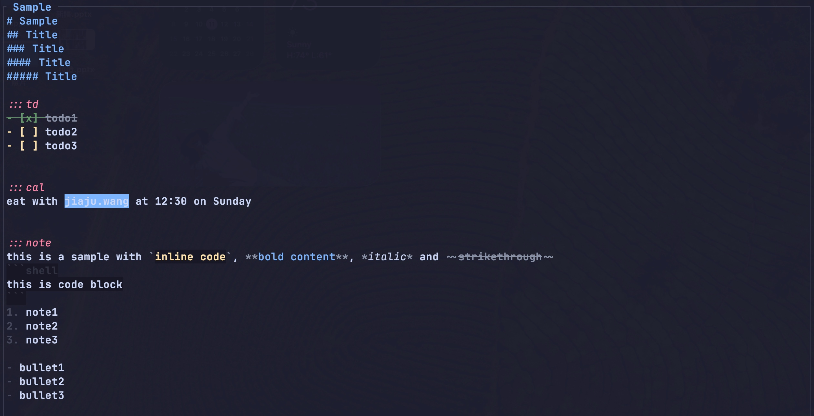

# Kenotex

A Vim-style TUI note-taking application that intelligently distributes content to Apple Reminders, Calendar, and Notes apps.

<p align="center">
  
  
</p>
<p align="center">
  <em>Tokyo Night</em> &nbsp;&nbsp;&nbsp;&nbsp;&nbsp;&nbsp;&nbsp;&nbsp; <em>Gruvbox</em>
</p>

## Features

- Vim-style modal editing (Normal / Insert / Visual / Search)
- Syntax highlighting for Markdown, `:::` tags, and `@time` expressions
- Smart content distribution to Apple Reminders, Calendar, Notes, Bear, Obsidian
- Auto-pair insertion, visual selection wrapping
- List continuation and smart Tab indentation
- Soft-wrap with hanging indent for list items
- CJK / wide-character full support
- 7 built-in themes (Tokyo Night, Gruvbox, Nord, Catppuccin variants)
- Fully customizable keybindings
- Live reload, auto-save, auto-archive

## Quick Start

1. **Install** via Homebrew:
   ```bash
   brew tap kenxcomp/tap && brew install kenotex
   ```

2. **Run** the application:
   ```bash
   kenotex
   ```

3. **Create a note**: Press `Space + nn` to create a new note.

4. **Write content**: Press `i` to enter Insert mode and start typing.

5. **Use tags** to mark content for distribution:
   ```
   :::td
   - Buy groceries @tomorrow
   - Call dentist @3pm
   :::

   :::cal
   Team meeting @Monday 10am
   :::
   ```

6. **Distribute**: Press `Esc` to return to Normal mode, then `Space + s` to process and send blocks to their destination apps.

## Installation

### Homebrew (macOS / Linux)

```bash
brew tap kenxcomp/tap && brew install kenotex
```

### Build from Source

```bash
git clone https://github.com/kenxcomp/kenotex.git
cd kenotex
cargo build --release

# Run
./target/release/kenotex
```

## Usage

Kenotex uses a **strict tag-only system** — only content wrapped in explicit tag pairs is processed:

- `:::td ... :::` — Reminders
- `:::cal ... :::` — Calendar events
- `:::note ... :::` — Notes (Apple Notes / Bear / Obsidian)

```markdown
:::td
- Prepare slides @Friday
- Review PR #123
:::

:::cal
Team standup @tomorrow 10am
:::

:::note
Remember to ask about Q2 roadmap
:::
```

For full syntax details, list handling, and time expressions, see the [Usage Guide](docs/usage.md).

## Configuration

Config file location: `~/.config/kenotex/config.toml`

```toml
[general]
theme = "tokyo_night"
leader_key = " "
auto_save_interval_ms = 5000
show_hints = true
tab_width = 4
```

For destinations, keybindings, and all options, see the [Configuration Guide](docs/configuration.md).

## Documentation

| Document | Description |
|----------|-------------|
| [Usage Guide](docs/usage.md) | Tag syntax, list handling, time expressions |
| [Keybindings](docs/keybindings.md) | All keyboard shortcuts by mode |
| [Configuration](docs/configuration.md) | Config options, destinations, themes |
| [Architecture](docs/architecture.md) | Layered architecture and dependencies |
| [Default Config](docs/default.toml) | Complete config reference with comments |

## License

MIT
