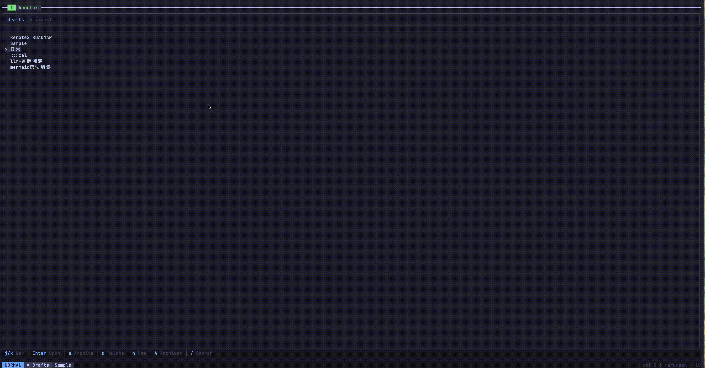
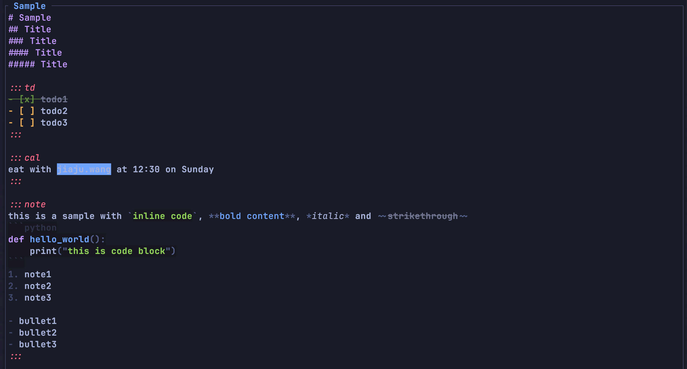
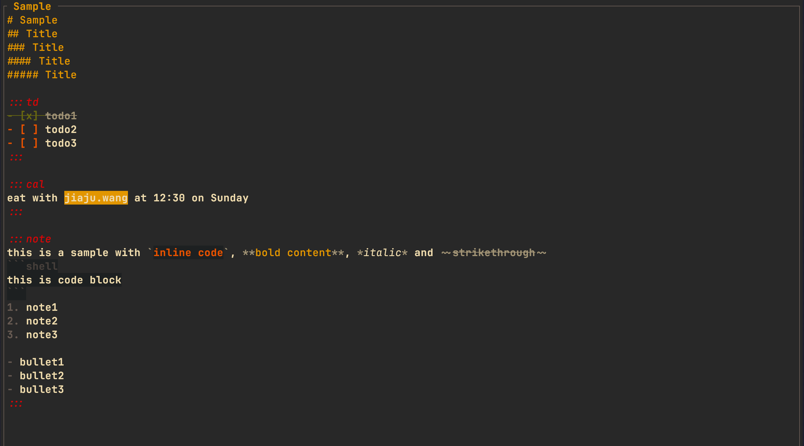

# Kenotex

一款 Vim 风格的终端笔记应用，能够智能地将内容分发到 Apple 提醒事项、日历和备忘录应用。

<p align="center">
  
</p>

<p align="center">
  
  <br>
  <em>Tokyo Night</em>
</p>

<p align="center">
  
  <br>
  <em>Gruvbox</em>
</p>

## 功能特性

- Vim 风格模态编辑（Normal / Insert / Visual / Search）
- Markdown、`:::` 标签、`@time` 表达式和围栏代码块语法高亮
- 智能内容分发到 Apple 提醒事项、日历、备忘录、Bear、Obsidian
- 自动配对插入、Visual 选区包裹
- 列表续行和智能 Tab 缩进
- 列表项软换行悬挂缩进
- CJK / 全角字符完整支持
- 7 种内置主题（Tokyo Night、Gruvbox、Nord、Catppuccin 变体）
- 复选框排序（未勾选上移，已勾选下移）
- 完全可自定义的快捷键
- 实时重载、自动保存、自动归档

## 快速开始

1. **安装**（通过 Homebrew）：
   ```bash
   brew tap kenxcomp/tap && brew install kenotex
   ```

2. **运行**应用：
   ```bash
   kenotex
   ```

3. **创建笔记**：按 `空格 + nn` 创建新笔记。

4. **编写内容**：按 `i` 进入 Insert 模式开始输入。

5. **使用标签**标记需要分发的内容：
   ```
   :::td
   - 明天买菜 @明天
   - 下午三点打电话给牙医 @3pm
   :::

   :::cal
   团队会议 @周一上午10点
   :::
   ```

6. **分发**：按 `Esc` 返回 Normal 模式，然后按 `空格 + s` 处理并发送内容块到目标应用。

## 安装

### Homebrew（macOS / Linux）

```bash
brew tap kenxcomp/tap && brew install kenotex
```

### 从源码构建

```bash
git clone https://github.com/kenxcomp/kenotex.git
cd kenotex
cargo build --release

# 运行
./target/release/kenotex
```

## 使用方法

Kenotex 使用**严格的标签系统** — 只有被显式标签对包裹的内容才会被处理：

- `:::td ... :::` — 提醒事项
- `:::cal ... :::` — 日历事件
- `:::note ... :::` — 备忘录（Apple Notes / Bear / Obsidian）

```markdown
:::td
- 准备演示文稿 @周五
- 审查 PR #123
:::

:::cal
明天早上10点团队站会
:::

:::note
记得询问 Q2 路线图
:::
```

完整的标签语法、列表处理和时间表达式详情，请参阅[使用指南](docs/usage_cn.md)。

## 配置

配置文件位置：`~/.config/kenotex/config.toml`

```toml
[general]
theme = "tokyo_night"
leader_key = " "
auto_save_interval_ms = 5000
show_hints = true
tab_width = 4
```

目标应用、快捷键及所有选项，请参阅[配置指南](docs/configuration_cn.md)。

## 文档

| 文档 | 说明 |
|----------|-------------|
| [使用指南](docs/usage_cn.md) | 标签语法、列表处理、时间表达式 |
| [快捷键](docs/keybindings_cn.md) | 按模式分类的所有键盘快捷键 |
| [配置](docs/configuration_cn.md) | 配置选项、目标应用、主题 |
| [架构](docs/architecture_cn.md) | 分层架构和依赖 |
| [默认配置](docs/default.toml) | 完整配置参考（含注释） |

## 许可证

MIT
